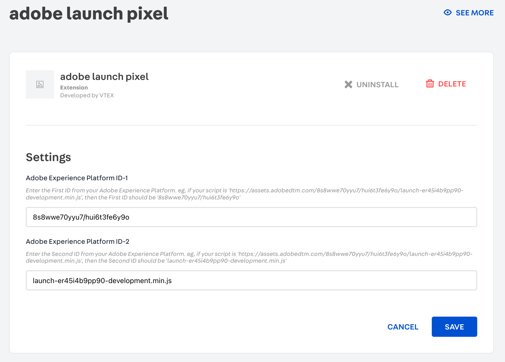
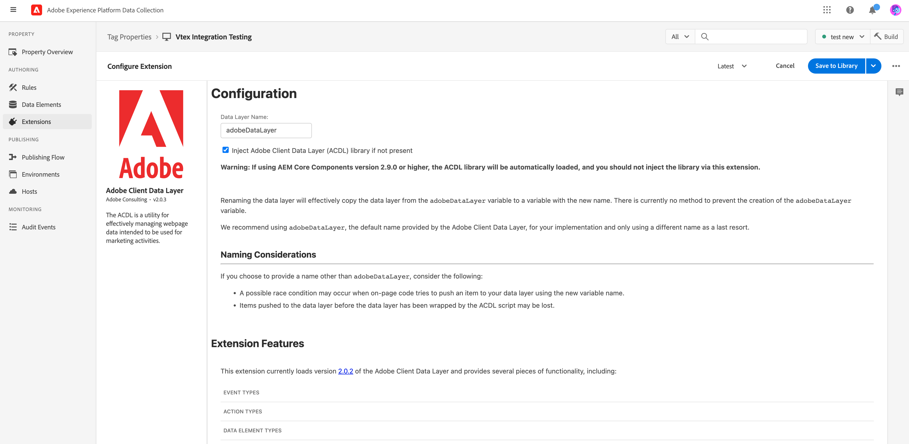
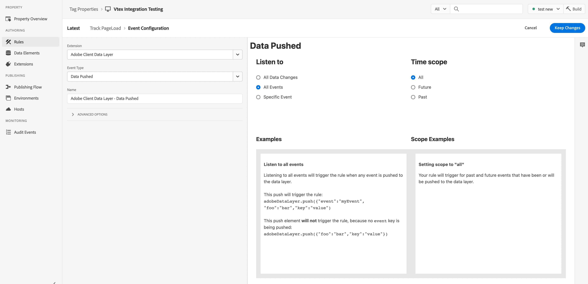
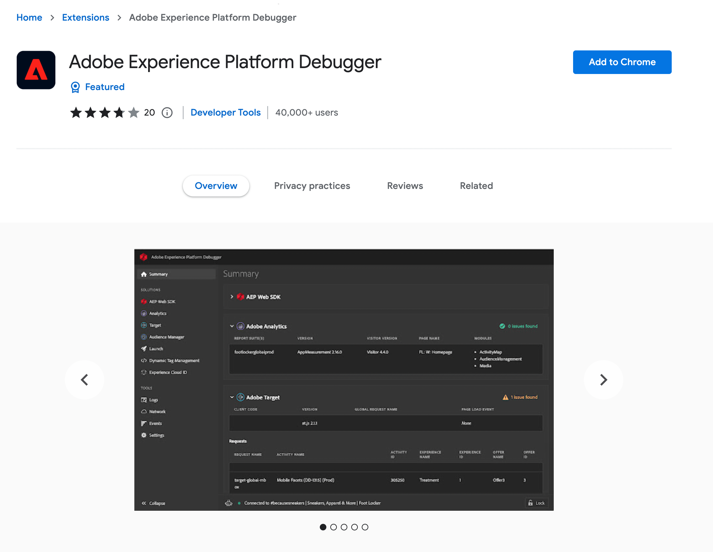
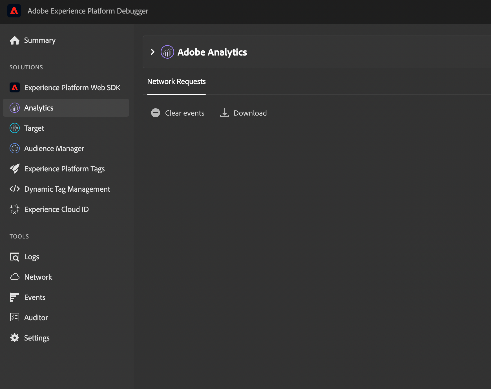

📢 Use this project, [contribute](https://github.com/vtex-apps/adobe-launch-pixel) to it or open issues to help evolve it using [Store Discussion](https://github.com/vtex-apps/store-discussion).

# Adobe Launch

##  ⚠️ Maintenance ⚠️
*Starting June 1st 2023, this application will no longer be maintained by VTEX.*

---

The VTEX Adobe Launch app is a first party integration to the [Adobe Experience Platform Launch](https://launch.adobe.com/).


## Installation and configuration

### Step 1 - Installing Adobe Launch app
Install `vtexasia.adobe-launch-pixel` in your account.

    
    vtex install vtexasia.adobe-launch-pixel@0.x
    

>ℹ️ **Info**
>
> Access the [Adobe Experience Platform Launch](https://launch.adobe.com/)</a> and login to you account in order to find out what is your account **Adobe Launch ID**. The number your should use is the one provided by the `Environments` section. Select the environment you prefer, click the box icon, and a pop-up with web installation instructions will appear. Use the script there to set up the app. 

>⚠️ **Warning**
>
> Make sure you set up a library under your selected environment, since later all the configurations will be added to that library. 


Follow the instructions provided by the Adobe Launch App in the `Admin` > `Account Seetings` > `Apps` > `My Apps` > `adobe launch pixel`



### Step 2 - Setup Adobe Launch
To set up Adobe Launch in your store, you must create and set up all necessary tags, rules and data elements. 

#### Install Extension, creating Rules and Data elements

1. Log in to your [Adobe Launch account](https://launch.adobe.com/) and click on the tags you want to work with.

2. On the tags page, click on **Extensions**, make sure you have installed the Adobe Analytics, Adobe Client Data Layer, Core and Experience Cloud ID Service.


Configure the Adobe Client Data Layer in the following way: the Data Layer Name is `adobeDataLayer`, and Inject Adobe Client Data Layer (ACDL) library if not present.



3. In the **Rules** section, create a new rule.


Follow the event configuraion below.



Follow the action configuration below.


>ℹ️ **Info**
>
> The Variables you set here will be later used as the data elements.


Click `Save to Library` after finished the above steps.

4. Go to the **Data Element** section and create a new data element using the variables created in the previous step.


Click `Save to Library` after finished the above steps.

5. Click `Build` to save all changes into the Library.

#### Checking received data

Now, let's check the received data from your website.

1. Go to the **Chrome Web Store**.
2. Install the [**Adobe Experience Platform Debugger**](https://chrome.google.com/webstore/detail/adobe-experience-platform/bfnnokhpnncpkdmbokanobigaccjkpob?hl=en-GB) extension.



3. Open the Adobe Experience Platform Debugger, and you should able to see the data sent from your website under `Analytics` section.



>ℹ️ **Info**
>
> If you are not able to see any data, go to your Chrome's Developer Tools, under `Application` section, go to `Service Workers` and select `Bypass for network`. Refresh the page and check the debugger again. If it is still not working, check your setup for Adobe Launch.
>
>
> 


## Native VTEX events

The app listens to VTEX storefront native events (excluding interim steps in the checkout page) and transforms them into payloads and pushes into adobeDataLayer, so that Adobe Launch can consume it natively.

List of events: 

| Events | Triggers |
| --- | --- |
| addToCart | Triggered when a product is added to the cart |
| cartChanged | Triggered when there is a change in cart |
| cartId | Triggered on every loaded page view |
| homePageInfo | Triggered on every loaded home page view |
| orderPlaced | Triggered when an order is placed |
| pageView | Triggered on every loaded page view |
| productClick | Triggered on every product click |
| productImpression | Triggered when product data is visible on the page currently being accessed by users |
| productView | Triggered on every product view |
| promoClick | Triggered on every promotion click |
| promoView | Triggered on every promotion view |
| removeFromCart | Triggered when a product is removed from the cart |
| searchPageInfo |  Triggered on every loaded search page view |
| userData | Triggered on every loaded page view |


## App functionality
Our app is built with Adobe Client Data Layer (ACDL), It introduces a standard method to collect and store data about a website user's experience and then make it easy to access this data.

The app push the native VTEX events into the ACDL, so that they can be shown from Adobe Experience Platform Debugger.

```tsx
        window.adobeDataLayer.push({
          homePageInfo: {
            eventType: "homeView"
          }
        })
```

You can check how ACDL works from [here](https://experienceleague.adobe.com/docs/experience-manager-learn/sites/integrations/adobe-client-data-layer/data-layer-overview.html?lang=en#adobe-client-data-layer).
